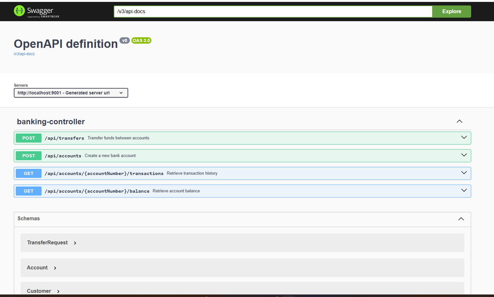

# Banking API


A modern, RESTful banking API built with **Spring Boot** to manage customer accounts, process transactions, and provide financial insights. Designed with clean architecture, robust testing, and API documentation, this project demonstrates my skills in backend development.

---

## 🌟 What Does This Project Do?

This project implements a banking API that allows bank employees to:
- **Create Accounts**: Set up new bank accounts for customers with an initial deposit.
- **Transfer Funds**: Move money between accounts, even across different customers.
- **Retrieve Balances**: Check the current balance of any account.
- **View Transaction History**: Access a detailed log of transactions for an account.

The API is documented using Swagger UI, making it easy to explore and test the endpoints interactively.

---

## 📸 Swagger UI Screenshot


*Interactive API documentation showcasing available endpoints.*

---

## 🛠️ Technologies Used

- **Java 17**: Core programming language.
- **Spring Boot 3.x**: Framework for building the API.
- **Spring Data JPA**: For database interactions with H2 in-memory database.
- **Maven**: Dependency management and build tool.
- **Swagger (Springdoc)**: API documentation.
- **JUnit 5 & Mockito**: Unit and integration testing.

---

## 📋 Prerequisites

- Java 17 JDK
- Maven 3.6+
- Git

---

## 🏃‍♂️ Getting Started

1. **Clone the Repository**:
   ```bash
   git clone https://github.com/your-username/banking-api.git
   cd banking-api
